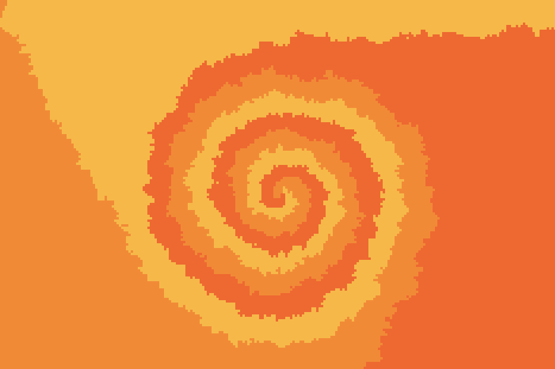

# Rock Paper Automaton

Cellular automaton playing rock paper scissors on HTML5 canvas.

In this simulation, every pixel is a cell. In the likes of [John Conway](https://en.wikipedia.org/wiki/John_Horton_Conway)'s [Game of Life](https://en.wikipedia.org/wiki/Conway%27s_Game_of_Life), at each simulation step, every cell decides its next color based on its neighbors' colors. Unlike Conway's game, though, there are three states (or colors) instead of just "dead" or "alive". Here's where the rock paper scissors analogy comes into play. Whenever a cell of a certain category is confronted with another of a different category, it will either "eat" or be "eaten" by the other. The rules are:

- C eats B
- B eats A
- A eats C

Given that each color is given a fair share of the initial state area, the simulation can achieve a well-balanced, repeating pattern that will continue indefinitely.

While trying different configurations, I ended up with the current set of rules I use. In my implementation, for each cell, I pick one adjacent neighbor at random. Picking a neighbor at random generates the squiggly effect that can be seen in the simulation. To keep it simple, I use the [Von Neumann neighborhood](https://en.wikipedia.org/wiki/Von_Neumann_neighborhood). Once a neighbor is chosen, I check whether it can eat the current cell being evaluated. Before checking the rock paper scissors rules stated above, however, the algorithm first checks if the cell is *too young*. Think of it as a "summoning sickness" rule. If the cell is too young, it cannot be eaten yet. This helps generate a more visually appealing simulation. If the cell is old enough, though, it is eaten and its age counter resets back to zero ("just born").

## Technical notes

If you felt motivated to run your own simulation, have in mind that each new global state has to be computed using an auxiliary data structure. Every neighbor interaction result needs to be stored in the auxiliary structure. Committing the interaction to the main structure while there are other cells to be evaluated will lead you to an inconsistent global state, because the next cell will now use the result of a neighbor at time t+1, when it should have based its next state on its neighbor at time t. Only when the auxiliary structure finally holds a complete global state is that you can show it on the screen. This is analogous to any procedural animation, where the next frame is drawn in memory while the current one is being displayed. When the next frame is ready, the simulation simply swaps buffers.

The most popular screen resolution we have nowadays is full HD, i.e., 1920x1080. This means that we'd have around 2 million cells to simulate if each pixel was an automaton and we were to render the whole screen. That's too much processing power required for a simple Javascript application not making use of WebGL acceleration, so I cheat a little by using a 1:2 scale. Every pixel in my canvas is rendered using 4 screen pixels (a 2x2 square). The final pixelated visual aesthetics ends up being a pleasing one anyway, so there's my excuse :-).

Even 1:2 scale is hard to do using only CPU. I developed my own technique to be able to achieve 60 Hz on regular desktop/mobile clients. My code is 100% vanilla JS and I'm using modern JavaScript to be as efficient as I can. One very important thing is reducing the number of writes to the canvas buffer. After several iterations, I learned that one clever improvement is to map the canvas buffer to a Uint32Array structure. That allows you to write only once per pixel where sample code on the internet normally writes four times per pixel (once for every RGBA channel). One caveat when doing this, though, is that you have to consider the endianness of the client machine! See my code for more details.
